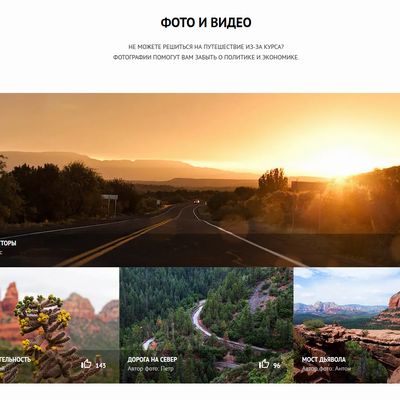
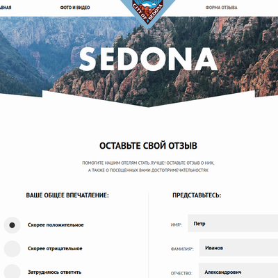

# Личный проект «Седона»

* Студент: [Антон Леонидович](https://up.htmlacademy.ru/adaptive/17/user/948947).
* Наставник: [Оксана Вайнруб](https://htmlacademy.ru/profile/id166797).

---
### Описание
Седона — сервис поиска гостиниц в небольшом городке. Проект интенсива *«HTML и CSS. Адаптивная вёрстка и автоматизация»*. Демонстрация навыков адаптивной вёрстки, препроцессоров и автоматизации. Дизайн и контент - собственность HTML-академии. Весь HTML, CSS и JavaScript-код полностью мои.

[Посмотреть готовую работу](https://utavegu.github.io/sedona-build/)

---

 
